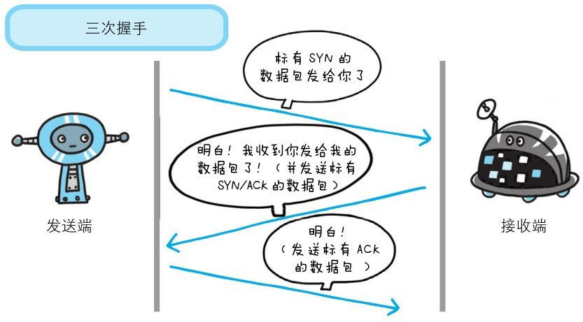

## 网络基础 TCP/IP 协议族

### 1. 什么是协议？

计算机与网络设备要相互通信，双方就必须基于相同的方法。比如，如何探测到通信目标、由哪一边先发起通信、使用哪种语言进行通信、怎样结束通信等规则都需要事先确定。不同的硬件、操作系统之间的通信，所有的这一切都需要一种规则。而我们就把这种规则称为**协议**（protocol）。

### 2. TCP/IP

**TCP/IP** 是指互联网相关联的协议集合的总称。

如下图是 TCP/IP 协议族中个各类协议。

### 3. TCP/IP 的分层管理

TCP/IP 协议族按层次分别分为以下 4 层：**应用层**、**传输层**、**网络层**和**数据链路层**。

TCP/IP层次化是有好处的。比如，如果互联网只由一个协议统筹，某个地方需要改变设计时，就必须把所有部分整体替换掉。而分层之后只需把变动的层替换掉即可。把各层之间的接口部分规划好之后，每个层次内部的设计就能够自由改动了。

层次化之后，设计也变得相对简单。处于应用层上的应用可以只考虑分派给自己的任务，而不需要弄清对方在地球上哪个地方、对方的传输路线是怎样的、是否能确保传输送达等问题。

#### 3.1 应用层

应用层决定了向用户提供应用服务时通信的活动。

TCP/IP 协议族内预存了各类通用的应用服务。比如，FTP（File Transfer Protocol，文件传输协议）和DNS（Domain Name System，域名系统）服务就是其中两类。

HTTP 协议也处于该层。

#### 3.2 传输层

传输层对上层应用层，提供处于网络连接中的两台计算机之间的数据传输。

在传输层有两个性质不同的协议：TCP（Transmission Control Protocol，传输控制协议）和UDP（User Data Protocol，用户数据报协议）。

#### 3.3 网络层

网络层用来处理在网络上流动的数据包。数据包是网络传输的最小数据单位。该层规定了通过怎样的路径（所谓的传输路线）到达对方计算机，并把数据包传送给对方。

与对方计算机之间通过多台计算机或网络设备进行传输时，网络层所起的作用就是在众多的选项内选择一条传输路线。

#### 3.4 链路层

用来处理连接网络的硬件部分。包括控制操作系统、硬件的设备驱动、NIC（Network InterfaceCard，网络适配器，即网卡），及光纤等物理可见部分（还包括连接器等一切传输媒介）。硬件上的范畴均在链路层的作用范围之内。

### 4. IP 协议

按层次分，**IP**（Internet Protocol）网际协议位于网络层。

**IP 协议**的作用是把各种数据包传送给对方。而要保证确实传送到对方那里，则需要满足各类条件。其中两个重要的条件是 IP 地址和 MAC 地址（Media Access Control Address）。

**IP 地址**指明了节点被分配到的地址，**MAC地址**是指网卡所属的固定地址。IP 地址可以和 MAC 地址进行配对。IP 地址可变换，但 MAC 地址基本上不会更改。

### 5. TCP 协议

TCP 位于传输层，提供可靠的字节流服务。

**字节流服务**（Byte Stream Service）是指，为了方便传输，将大块数据分割成以报文段（segment）为单位的数据包进行管理。

**可靠的传输服务**是指，能够把数据准确可靠地传给对方。

#### 5.1 三次握手

为了准确无误地将数据送达目标处，TCP 协议采用了三次握手（three-way handshaking）策略。

用 TCP 协议把数据包送出去后，TCP 不会对传送后的情况置之不理，它一定会向对方确认是否成功送达。握手过程中使用了 TCP 的标志（fag）——SYN（synchronize）和ACK（acknowledgement）。

发送端首先发送一个带 SYN 标志的数据包给对方。接收端收到后，回传一个带有 SYN/ACK 标志的数据包以示传达确认信息。最后，发送端再回传一个带 ACK 标志的数据包，代表“握手”结束。

