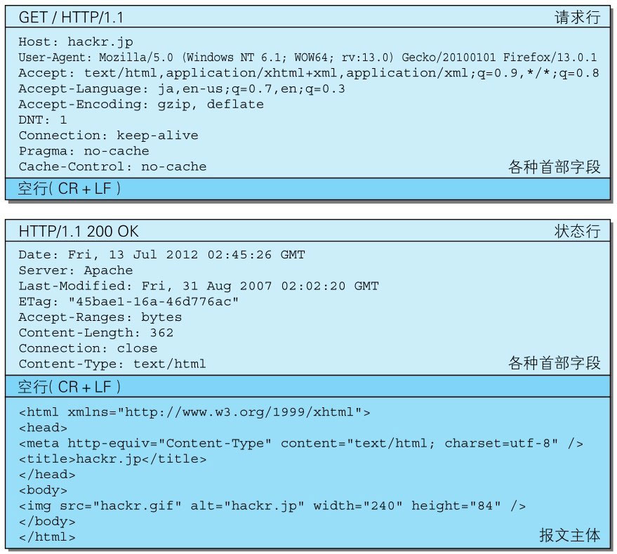

## HTTP 报文

用于 HTTP 协议交互的信息被称为 **HTTP 报文**。

请求端（客户端）的HTTP报文叫做**请求报文**，响应端（服务器端）的叫做**响应报文**。

HTTP 报文本身是由多行（用CR+LF作换行符）数据构成的字符串文本。

HTTP 报文大致可分为报文首部和报文主体两块。两者由最初出现的空行（CR+LF）来划分。通常，并不一定要有报文主体。

请求报文和响应报文的首部内容由以下数据组成：

**请求行**

包含用于请求的方法，请求URI和HTTP版本。

**状态行**

包含表明响应结果的状态码，原因短语和HTTP版本。

**首部字段**

包含表示请求和响应的各种条件和属性的各类首部。

一般有4种首部，分别是：通用首部、请求首部、响应首部和实体首部。

**其他**

可能包含HTTP的RFC里未定义的首部（Cookie等）。

