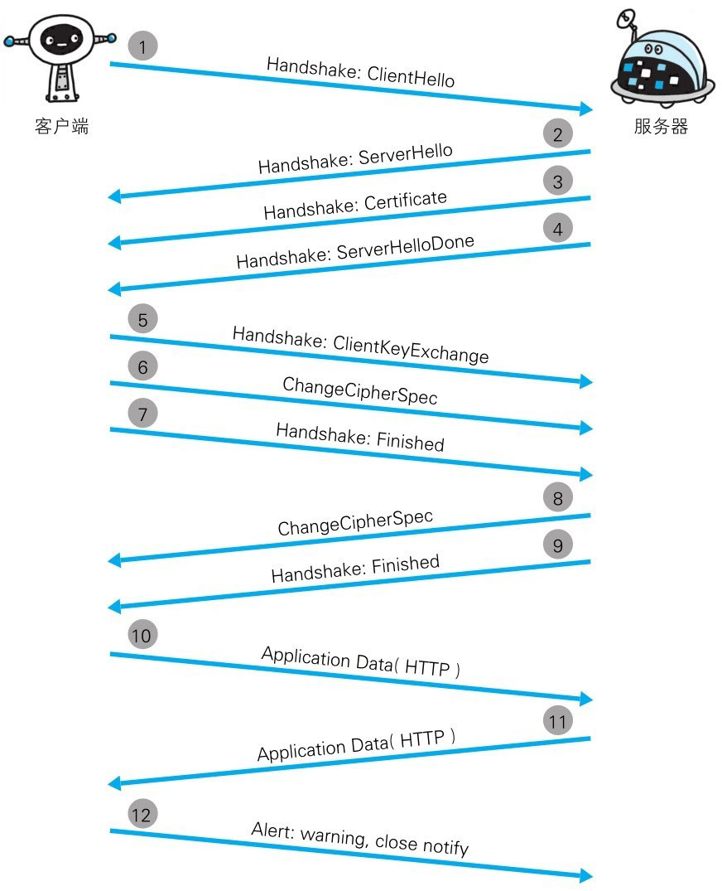

## HTTP+加密+认证+完整性保护=HTTPS

把添加了加密及认证机制的HTTP称为 **HTTPS**（HTTP Secure）。

HTTPS 并非是应用层的一种新协议。只是HTTP通信接口部分用SSL（Secure Socket Layer）和TLS（Transport Layer Security）协议代替而已。

通常，HTTP直接和TCP通信。当使用SSL时，则演变成先和SSL通信，再由SSL和TCP通信了。简言之，所谓HTTPS，其实就是身披SSL协议这层外壳的HTTP。

**SSL** 是独立于HTTP的协议，所以不光是HTTP协议，其他运行在应用层的SMTP和Telnet等协议均可配合SSL协议使用。可以说SSL是当今世界上应用最为广泛的网络安全技术。

 **HTTPS的安全通信机制**

**步骤1**： 客户端通过发送Client Hello报文开始SSL通信。报文中包含客户端支持的SSL的指定版本、加密组件（Cipher Suite）列表（所使用的加密算法及密钥长度等）。

**步骤2**： 服务器可进行SSL通信时，会以Server Hello报文作为应答。和客户端一样，在报文中包含SSL版本以及加密组件。服务器的加密组件内容是从接收到的客户端加密组件内筛选出来的。

**步骤3**： 之后服务器发送Certificate报文。报文中包含公开密钥证书。

**步骤4**： 最后服务器发送Server Hello Done报文通知客户端，最初阶段的SSL握手协商部分结束。

**步骤5**: SSL第一次握手结束之后，客户端以Client Key Exchange报文作为回应。报文中包含通信加密中使用的一种被称为Pre-master secret的随机密码串。该报文已用步骤3中的公开密钥进行加密。

**步骤6**： 接着客户端继续发送Change Cipher Spec报文。该报文会提示服务器，在此报文之后的通信会采用Pre-master secret密钥加密。

**步骤7**： 客户端发送Finished报文。该报文包含连接至今全部报文的整体校验值。这次握手协商是否能够成功，要以服务器是否能够正确解密该报文作为判定标准。

**步骤8**： 服务器同样发送Change Cipher Spec报文。

**步骤9**： 服务器同样发送Finished报文。

**步骤10**： 服务器和客户端的Finished报文交换完毕之后，SSL连接就算建立完成。当然，通信会受到SSL的保护。从此处开始进行应用层协议的通信，即发送HTTP请求。

**步骤11**： 应用层协议通信，即发送HTTP响应。

**步骤12**： 最后由客户端断开连接。断开连接时，发送close_notify报文。上图做了一些省略，这步之后再发送TCP FIN报文来关闭与TCP的通信。