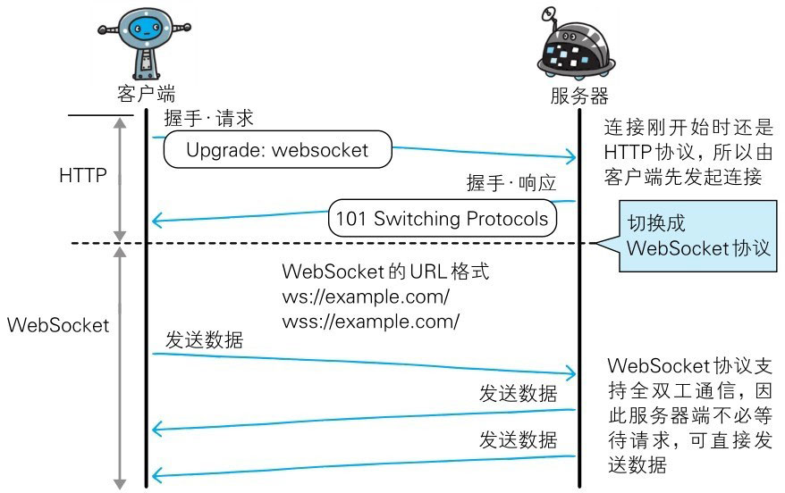

## 使用浏览器进行全双工通信的 WebSocket

利用Ajax和Comet技术进行通信可以提升Web的浏览速度。但问题在于通信若使用HTTP协议，就无法彻底解决瓶颈问题。WebSocket网络技术正是为解决这些问题而实现的一套新协议及API。

当时筹划将WebSocket作为HTML5标准的一部分，而现在它却逐渐变成了独立的协议标准。WebSocket通信协议在2011年12月11日，被RFC 6455- The WebSocket Protocol定为标准。

### WebSocket 协议

一旦Web服务器与客户端之间建立起WebSocket协议的通信连接，之后所有的通信都依靠这个专用协议进行。通信过程中可互相发送JSON、XML、HTML或图片等任意格式的数据。

由于是建立在HTTP基础上的协议，因此连接的发起方仍是客户端，而一旦确立WebSocket通信连接，不论服务器还是客户端，任意一方都可直接向对方发送报文。

**WebSocket 协议的主要特点**：

1. **推送功能**

支持由服务器向客户端推送数据的推送功能。这样，服务器可直接发送数据，而不必等待客户端的请求。

2. **减少通信量**

只要建立起WebSocket连接，就希望一直保持连接状态。和HTTP相比，不但每次连接时的总开销减少，而且由于WebSocket的首部信息很小，通信量也相应减少了。


**握手·请求**

为了实现WebSocket通信，需要用到HTTP的Upgrade首部字段，告知服务器通信协议发生改变，以达到握手的目的。

```
GET /chat HTTP/1.1
Host: server.example.com
Upgrade: websocket
Connection: Upgrade
Sec-WebSocket-Key: dGhlIHNhbXBsZSBub25jZQ==
Origin: http://example.com
Sec-WebSocket-Protocol: chat, superchat
Sec-WebSocket-Version: 13
```


**握手·响应**

对于之前的请求，返回状态码101 Switching Protocols的响应。

```
HTTP/1.1 
101 Switching Protocols
Upgrade: websocket
Connection: Upgrade
Sec-WebSocket-Accept: s3pPLMBiTxaQ9kYGzzhZRbK+xOo=
Sec-WebSocket-Protocol: chat
```





**WebSocket API**

JavaScript可调用“The WebSocket API”（http://www.w3.org/TR/websockets/，由W3C标准制定）内提供的WebSocket程序接口，以实现WebSocket协议下全双工通信。

以下为调用WebSocket API，每50ms发送一次数据的实例。

```javascript
var socket = new WebSocket('ws://game.example.com:12010/updates');

socket.onopen = function () {
	setInterval(function() {
		if (socket.bufferedAmount == 0)
         socket.send(getUpdateData());
    }, 50);
};
```

