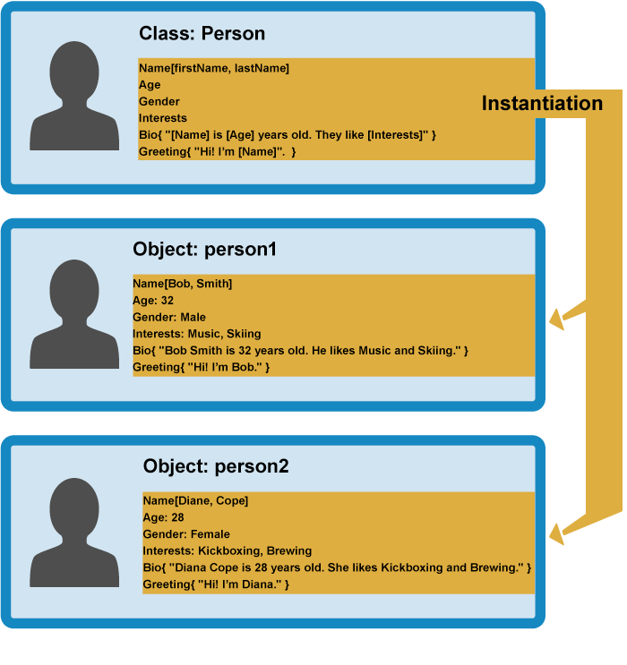
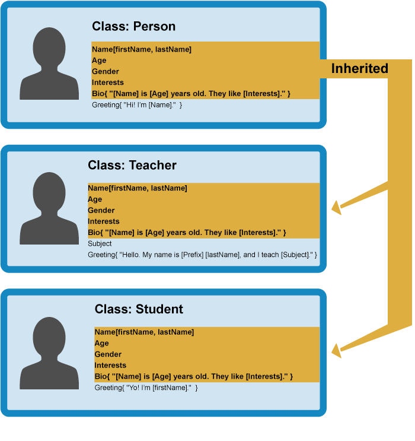

## JavaScript 面向对象编程

### 面向对象编程

**面向对象编程**（Object-oriented programming ，OOP）的基本思想是：在程序里，通过使用对象去构建现实世
界的模型，把原本很难（或不可能）被使用的功能，简单化并提供出来，以供访问。

对象可以包含相关的数据和代码，这些数据和代码用于表示所建造的模型是什么样子，以及拥有什么样的行为或功能。

对于一个人（person）来说，可以在他身上获取到住址，身高，鞋码，基因图谱，护照信息，显著的性格特征等等，然后还有他所具有的能力，比如打招呼、唱歌等。对于人的特征可以做为一个对象的**属性**，所具有的能力则可以作为对象的**方法**。以上的方式被称为**抽象** - 为了我们编程的目标而利用事物的一些重要特性去把复杂的事物简单化。

### 对象的模版 - 类 Class

在一些面向对象的语言中，我们用**类（class）**的概念去描述一个对象（您在下面就能看到JavaScript使用了一个完全不同的术语）-类并不完全是一个对象，它更像是一个定义对象特质的模板。


### 对象的实例化

创建的class中， 我们能够基于它创建出一些对象 - 一些拥有class中属性及方法的对象。

当一个对象需要从类中创建出来时，类的构造函数就会运行来创建这个实例。这种创建对象的过程我们称之为实例化-实例对象被类**实例化**。



### 构造函数和对象

ES6 之前 JavaScript 没有像许多面向对象的语言一样有用于创建class类的声明，JavaScript 用一种称为**构建函数**的特殊函数来定义对象和它们的特征。**构建函数**提供了创建所需对象（实例）的有效方法，将对象的数据和特征函数按需联结至相应对象。

1. **创建一个普通的函数**

通过函数创建一个对象，让它具有人的属性及特征。

```javascript
function createNewPerson(name) {
  var obj = {};
  obj.name = name;
  obj.greeting = function () {
    alert('Hi! I\'m ' + this.name + '.');
  }
  return obj;
}
```

2. **调用这个普通的函数创建一个对象**

通过调用这个函数创建一个新的叫 salva 的对象。

```javascript
var salva = createNewPerson('salva');
salva.name;
salva.greeting();
```

3. **通过构造函数改善创建对象**

上述的1、2 两步可以正常的创建对象，但是有点冗长，因为需要创建一个新的空对象并且返回它。

但是 JavaScript 通过构建函数提供了一个便捷的方法，如下：

```javascript
function Person(name) {
  this.name = name;
  this.greeting = function() {
    alert('Hi! I\'m ' + this.name + '.');
  };
}

var person1 = new Person('Bob');
var person2 = new Person('Sarah');
```

这里使用了`this`关键词，即无论是该对象的哪个实例被这个构建函数创建，它的 `name` 属性就是传递到构建函数形参`name`的值，它的 `greeting()` 方法中也将使用相同的传递到构建函数形参`name`的值。

关键字 `new` 跟着一个含参函数，用于告知浏览器我们想要创建一个对象，非常类似函数调用，并把结果保存到变量中。

>  一个构建函数通常是大写字母开头，这样便于区分构建函数和普通函数。

### 原型和原型链

在上面构造函数创建对象的过程中，每次通过 `new` 调用构造函数，都会重新定义一遍 `greeting()`，所以为了避免这样重复的定义，JavaScript 就出现了**原型**这种机制，实现对象从其他对象继承功能特性。

JavaScript 常被描述为一种**基于原型的语言 (prototype-based language)**——每个对象拥有一个**原型对象**，对象以其原型为模板、从原型继承方法和属性。原型对象也可能拥有原型，并从中继承方法和属性，一层一层、以此类推。这种关系被称为**原型链 (prototype chain)**，它解释了为何一个对象会拥有定义在其他对象中的属性和方法。

准确地说，这些属性和方法定义在 Object 的构造器函数(constructor functions)之上的 `prototype` 属性上，而非对象实例本身。

在传统的 OOP 中，首先定义“类”，此后创建对象实例时，类中定义的所有属性和方法都被复制到实例中。在 JavaScript 中并不如此复制——而是在对象实例和它的构造器之间建立一个链接（它是 `__proto__` 属性，是从构造函数的 `prototype` 属性派生的），之后通过上溯原型链，在构造器中找到这些属性和方法。

#### 对象原型和构造函数 prototype

原型是对象实现继承的一种机制，对象的原型可以通过 `Object.getPrototypeOf(obj)`或者已被弃用的`__proto__`属性获得，对象原型是每个实例上都有的属性。

构造函数的 `prototype` 是它的一个属性，也是原型链下游的对象继承的方法和属性被定义的地方。

构造函数可以通过 `prototype` 创建一些属性和方法，然后通过实例化创建出来的对象就会继承这些属性和方法，也就是所谓的对象原型，如下代码都是等价的：

```javascript
const Foobar = function(name) {
  this.name = name;
}

Foobar.prototype.greeting = function(message) {
  console.log(message);
}

Object.getPrototypeOf(new Foobar()) === Foobar.prototype; // true
new Foobar().__proto__ === Foobar.prototype; // true
```

> 原型链中的方法和属性**没有**被复制到其他对象——它们被访问需要通过前面所说的“原型链”的方式。

#### Object.create() 方法

`create()` 方法是 Object 构造函数上的一个方法，用于创建新的对象实例。`create()` 实际做的是从指定原型对象创建一个新的对象。

```javascript
const Foobar = function() {}

const foo1 = new Foobar();
const foo2 = Object.create(Foobar);

foo1.__proto__ === Foobar.prototype; // true
foo2.__proto__ === Foobar; // true
foo2.__proto__.prototype === foo1.__proto__ // true
```

#### constructor 属性

每个实例对象都从原型中继承了一个constructor属性，该属性指向了用于构造此实例对象的构造函数。

 ```javascript
 const Foobar = function() {}
 
 const foo = new Foobar();
 foo.constructor === Foobar; // true
 ```

**通过 constructor 作为构造器使用**

可以在 `constructor` 属性的末尾添加一对圆括号（括号中包含所需的参数），从而用这个构造器创建另一个对象实例。毕竟构造器是一个函数，故可以通过圆括号调用；只需在前面添加 `new` 关键字，便能将此函数作为构造器使用。

此场景可以用于因为某些原因没有原始构造器的引用，这种方法就很有用。

```javascript
const Foobar = function(name) {
  this.name = name;
}

const foo = new Foobar();
const foo1 = new foo.constructor('Jone');
```

**获取对象实例的构造器的名字**

如果想要获得某个对象实例的构造器的名字，可以这么用：

```javascript
const Foobar = function() {}

const foo = new Foobar();
foo.constructor.name; // "Foobar"
```


### JavaScript 中的继承

如果想表示出一个更具体的某类人，比如像老师(Teacher)和学生(Student)这样的类型。在 OOP 里，我们可以创建基于其它类的新类，这些新的子类可以继承它们父类的数据和功能。父对象拥有共有的功能，子对象拥有其专有的特征(属性)及行为(方法)。

这种基于父类创建出子类的过程就叫做对象的**继承**。



#### 原型式的继承

JavaScript 继承的对象函数并不是通过复制而来，而是通过原型链继承（通常被称为 **原型式继承 ——** **prototypal inheritance）**。

首先定义一些属性的 `Person()` 构造器

```javascript
function Person(first, last, age, gender, interests) {
  this.name = {
    first,
    last
  };
  this.age = age;
  this.gender = gender;
  this.interests = interests;
};
```

然后将方法定义在构造器的原型上

```javascript
Person.prototype.greeting = function() {
  alert('Hi! I\'m ' + this.name.first + '.');
};
```

最后通过 `Person` 实例化出来的对象，都会继承其原型上的属性和方法。

#### 构造函数继承

通过 `call` 改变调用函数内部的 this 指向。

```javascript
function Teacher(first, last, age, gender, interests, subject) {
  Person.call(this, first, last, age, gender, interests);

  this.subject = subject;
}
```

`Teacher()`构造函数里运行了`Person()`构造函数（见上文），得到了和在`Teacher()`里定义的一样的属性，但是用的是传送给`Teacher()`，而不是`Person()`的值（这里的`this`作为传给`call()`的`this`，意味着`this`指向`Teacher()`函数）。

#### 原型和构造器

仅仅通过 `call`方法无法继承 `Person` 原型上的方法和属性，如果要继续实现原型上的继承，如下：

```javascript
Teacher.prototype = Object.create(Person.prototype);
```

通过 `create` 方法，创建一个新对象并使其成为`Teacher.prototype`。新对象具有`Person.prototype`其原型，因此将在需要时继承所有可用的方法`Person.prototype`。

但是此时通过 Teacher 实例出来的对象，其 `constructor` 应该指向 `Teacher`，所以还需进行如下操作：

```javascript
Object.defineProperty(Teacher.prototype, 'constructor', {
  value: Teacher,
  enumerable: false, // so that it does not appear in 'for in' loop
  writable: true
});
```

#### ES6 Class 继承

